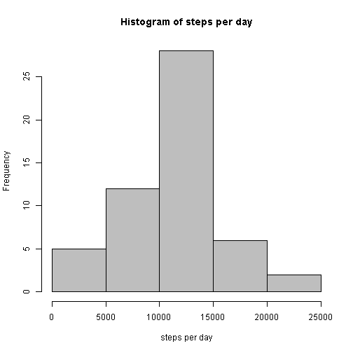
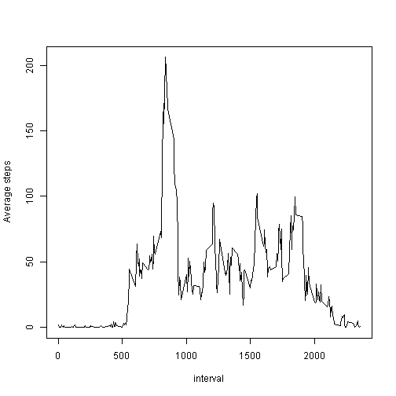
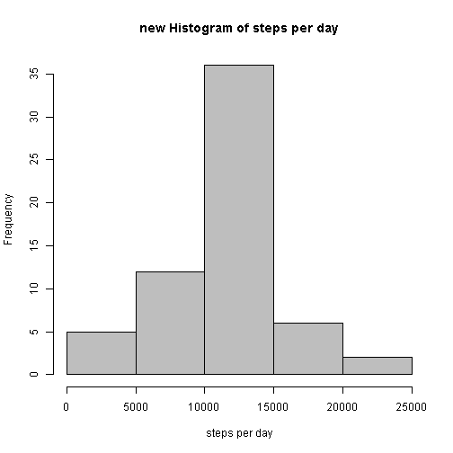
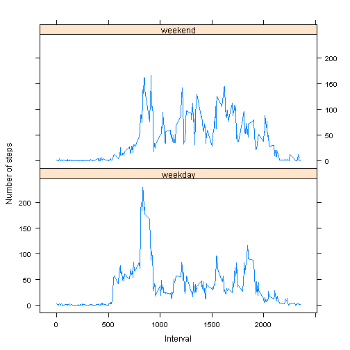

This is a report on analysis performed on the Personal Activity Monitoring Data.
Data is available at [Personal Activity data](https://d396qusza40orc.cloudfront.net/repdata%2Fdata%2Factivity.zip)

============================================================================  
__Loading and preprocessing the data__


```r
data <- read.csv("activity.csv")
summary(data)
```

```
##      steps                date          interval     
##  Min.   :  0.00   2012-10-01:  288   Min.   :   0.0  
##  1st Qu.:  0.00   2012-10-02:  288   1st Qu.: 588.8  
##  Median :  0.00   2012-10-03:  288   Median :1177.5  
##  Mean   : 37.38   2012-10-04:  288   Mean   :1177.5  
##  3rd Qu.: 12.00   2012-10-05:  288   3rd Qu.:1766.2  
##  Max.   :806.00   2012-10-06:  288   Max.   :2355.0  
##  NA's   :2304     (Other)   :15840
```

============================================================================  
__What is mean total number of steps taken per day?__

1. Calculating the number of steps per day using aggregate function

```r
dataagg <- aggregate(data$steps ~ data$date, data, FUN = "sum")
names(dataagg)<- c("day","steps")
head(dataagg)
```

```
##          day steps
## 1 2012-10-02   126
## 2 2012-10-03 11352
## 3 2012-10-04 12116
## 4 2012-10-05 13294
## 5 2012-10-06 15420
## 6 2012-10-07 11015
```

2. Let us plot the histogram of steps and see how it looks like.
We are also calculating mean and median values.

```r
hist(dataagg$steps, xlab = "steps per day", main = "Histogram of steps per day", col ="gray")
```

 

3. Calculating mean and median

```r
meanPerday <- as.integer(mean(dataagg$steps))
medianPerday <- median(dataagg$steps)
meanPerday
```

```
## [1] 10766
```

```r
medianPerday
```

```
## [1] 10765
```

Mean value for the steps per day is __10766__  
Median value for the steps per day is __10765__

============================================================================  
__What is the average daily activity pattern?__

1. creating time series plot of the 5-min interval and the average number of  
steps taken, averaged across all days

```r
dataagg1 <- aggregate(data$steps ~ data$interval, data, FUN = "mean")
names(dataagg1) <- c("interval","stepsAvg")
plot(dataagg1$interval, dataagg1$stepsAvg, type = "l", xlab = "interval",
     ylab = "Average steps")
```

 

2. Finding interval which contains maximum number of averaged steps

```r
maxSteps <- max(dataagg1$stepsAvg)
maxInt <- dataagg1[dataagg1$steps==maxSteps,1]
maxInt
```

```
## [1] 835
```
The interval which has maximum averaged steps is __835__

============================================================================  
__Imputing missing values__

1. Calculating total number of missing values in dataset


```r
sum(is.na(data$steps))
```

```
## [1] 2304
```

2. imputing the missing values.  
__Strategy__ here is to fill missing value with 
average number of steps for that interval across all days  
(note: we are using previously calculated avg steps for intervals across days)
3. completeData is the new dataset with missing data filled in

```r
completeData <- data
for (i in 1:nrow(completeData))
  if(is.na(completeData[i,1]))
    completeData[i,1] <- dataagg1[dataagg1$interval==completeData[i,3],2]  
```

4. Let us calculate new histogram, mean and meadian values per day

```r
dataaggNew <- aggregate(completeData$steps ~ completeData$date, completeData, FUN = "sum")
names(dataaggNew)<- c("day","steps")
hist(dataaggNew$steps, xlab = "steps per day", main = "new Histogram of steps per day", col="gray")
```

 

```r
meanPerdayNew <- as.integer(mean(dataaggNew$steps))
medianPerdayNew <- as.integer(median(dataaggNew$steps)) 
```
mean value before: __10766__ mean value after: __10766__  
median value before: __10765__ median value after: __10766__

So It is clear that there is no major difference in mean and median values

============================================================================  
__Are there differences in activity patterns between weekdays and weekends?__

1. creating new factor variable with factors 2 weekday and weekend


```r
completeData$day <- weekdays(as.POSIXct(completeData$date))

for (i in 1:nrow(completeData))
  completeData[i,4] <- if (completeData[i,4] == "Sunday" || completeData[i,4] == "Saturday") "weekend" else "weekday" 

completeData$day  <- as.factor(completeData$day)
```

2. Creating panel plot of the 5-minute interval and the average number of steps taken,  
averaged across all weekday days or weekend days (y-axis)

first let us calculate average number of steps avarage weekdays/weekend

```r
dataaggNew1 <- aggregate(completeData$steps ~ completeData$interval + completeData$day, data, FUN = "mean")
names(dataaggNew1) <- c("interval","day","stepsAvg")
```

Time to plot...

```r
require("lattice")
xyplot(stepsAvg ~ interval | day, dataaggNew1, type = "l", layout = c(1, 2), xlab = "Interval",
       ylab = "Number of steps")
```

 

Looking at the plot, it is clear that there is a difference in activity patterns on weekdays and weekends. We can observe high number of states on weekend for interval values ranging from 1000 to 2000 
